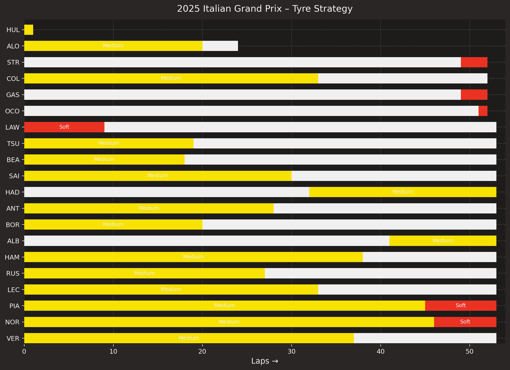

# 2025 Italian Grand Prix - Tyre Strategy

Stints and compounds by driver

{ loading=lazy }

## Why this matters

Stints and compounds by driver

This visual addresses a practical decision: what stands out when comparing the selected metric across the field?. It turns raw telemetry and timing data into a clear, decision-ready view that helps explain what happened and why it mattered.

## What the chart shows

- Stints and compounds by driver highlights the main pattern across the race, strategy comparison.
- The chart helps explain how the selected metric changes over the event or across the field.
- The result is useful for identifying performance gaps, strategy trade-offs, or timing differences.

## Data and method

- Data source: FastF1 session data for the selected season selected event
- Session: R
- Plot type: race analysis chart
- Filtering/selection: selected session filters and relevant race laps
- Key calculations: derived from lap-level and telemetry data for the selected comparison

## Technical implementation

This was built in Python using the project's reusable tooling:

- FastF1 for session loading and telemetry access
- custom chart helpers from the project library
- Matplotlib for the final rendering and styling
- YAML metadata and gallery generation to keep the output reproducible and easy to review

## Key findings

The main takeaway is that the chart makes the most important comparison immediately visible, which helps explain the analytical story behind the result.

This is the part of the analysis that matters most from a portfolio standpoint: the visual is not just a chart, it shows a decision point, a trend, or a strong signal supported by the underlying race data.

## Reproduce this chart

```bash
python tools/plots/tyre_strategy.py --driver-order results --bar-height 0.6 --bar-gap 0.35 --annotate-compound --dpi 220 --cache .fastf1-cache
```

## Skills demonstrated

- telemetry analysis
- Python plotting
- reproducible reporting
- visual storytelling

## Related examples

- [How it works](../how-it-works.md)
- [Gallery](../gallery.md)
