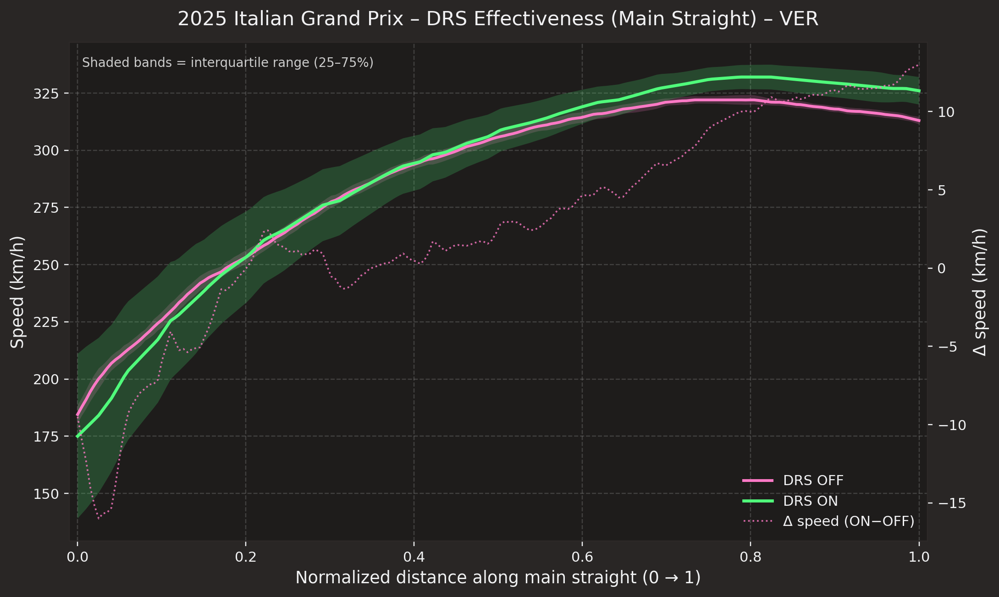

# 2025 Italian Grand Prix – DRS effect on main straight (VER)

Median speed traces along main straight (DRS ON/OFF)

{ loading=lazy }

## Why this matters

This chart isolates how much speed advantage DRS created on the main straight for Verstappen at Monza. It is a strong example of how telemetry can be aligned and compared to quantify a performance gain with a clear visual narrative.

This visual addresses a practical decision: how much benefit did DRS create on a known straight, and how clearly can the gain be seen when comparing the ON and OFF traces? It turns raw speed traces into a direct, measurable comparison.

## What the chart shows

- The ON/OFF traces show a visible speed uplift on the straight when DRS is active.
- The cumulative time-gain line makes the benefit easy to interpret as a total gain across the section.
- The chart is useful for identifying not only whether DRS helped, but how much of the advantage appeared in the final part of the straight.

## Data and method

- Data source: FastF1 telemetry for the 2025 Italian Grand Prix
- Session: race data for Verstappen
- Plot type: aligned speed trace and cumulative time gain comparison
- Filtering/selection: selected straight segment and DRS ON/OFF comparisons with smoothing across the straight
- Key calculations: aligned speed traces and cumulative time difference between the ON and OFF conditions

## Technical implementation

This was built in Python using the project’s reusable tooling:

- FastF1 for loading racing telemetry and session data
- custom chart helpers for the visual style and aligned comparison logic
- Matplotlib for the overlaid traces and cumulative gain annotations
- YAML metadata and gallery automation to keep the chart reproducible and reviewable

## Key findings

The chart makes the DRS gain easy to interpret visually: it is not just hypothetical speed gain, but a measurable advantage over a portion of the straight. That makes it a strong example of telemetry analysis with real, explainable engineering meaning.

This is the part of the analysis that matters most from a portfolio standpoint: the visual demonstrates how a raw data comparison can be transformed into a compelling, defensible engineering insight.

## Reproduce this chart

```bash
python tools/plots/drs_effectiveness.py --year 2025 --event "Italian Grand Prix" --session R --driver VER --cache .fastf1-cache
```

## Skills demonstrated

- telemetry alignment and comparison
- DRS analysis
- signal interpretation
- publication-quality chart design

## Related examples

- [Gallery](/gallery/)
- [2025 Italian Grand Prix – Tyre Strategy](./italian-grand-prix-2025-tyre-strategy.md)
- [How it works](/how-it-works/)
