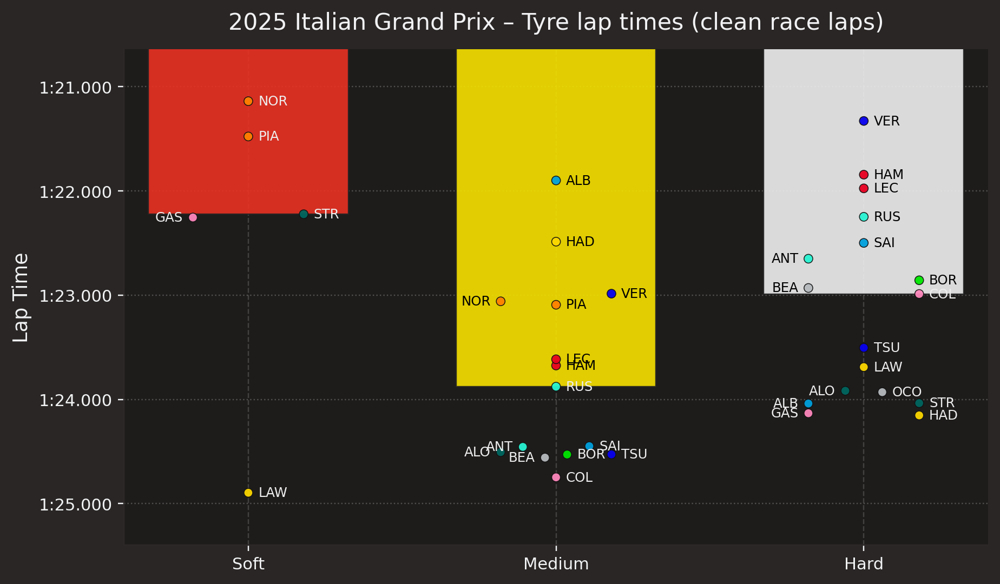

# 2025 Italian Grand Prix - Tyre lap times (clean race laps)

Bars = median across drivers; dots = each driver (team-colored), annotated by driver code

{ loading=lazy }

## Why this matters

This chart compares tyre performance across the field by showing median lap times by compound and plotting each driver around those group medians. It is a clean way to understand how the tyres behaved under race conditions and where individual drivers outperformed or underperformed their peers.

This visual addresses a practical decision: how did tyre compounds separate in genuine race conditions, and which drivers were strongest relative to the field on each compound? It turns raw lap timing into a readable comparison of race pace by tyre.

## What the chart shows

- The three tyre compounds separate clearly across the field, with soft, medium, and hard groupings that reflect true performance differences.
- The median bars make the category-level story visible, while the annotated driver points show the individual variation within each compound.
- This is an effective way to observe both overall tyre behavior and driver-level outperformance in a single view.

## Data and method

- Data source: FastF1 race lap telemetry for the 2025 Italian Grand Prix
- Session: race data
- Plot type: tyre compound lap-time comparison across the field
- Filtering/selection: clean race laps only; groups filtered by compound and median lap performance
- Key calculations: median lap time by compound and driver-level performance relative to the group median

## Technical implementation

This was built in Python using the project's reusable tooling:

- FastF1 for lap-time and tyre data access
- custom chart helpers for consistent styling and compound color logic
- Matplotlib for grouped performance visuals and annotation
- YAML metadata and the gallery generator to keep the output reviewable and reproducible

## Key findings

The chart makes it easy to see not only which tyre compounds were faster overall, but also where individual drivers deviated from the median. That gives the visual both a strategic dimension and a performance-analysis dimension, which makes it especially useful as a portfolio piece.

This is the part of the analysis that matters most from a portfolio standpoint: the visual translates complex lap data into a story about tyre performance, relative pace, and the practical differences between compounds.

## Reproduce this chart

```bash
python tools/plots/tyre_performance.py --year 2025 --event "Italian Grand Prix" --cache .fastf1-cache
```

## Skills demonstrated

- tyre performance analysis
- lap-time comparison work
- production-grade chart design
- performance communication

## Related examples

- [Gallery](../gallery.md)
- [2025 Italian Grand Prix - Tyre Strategy](./italian-grand-prix-2025-tyre-strategy.md)
- [Creating New Visuals](../creating-new-visuals/index.md)
