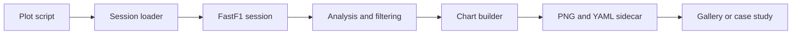

# Creating New Visuals

**From question to published chart**

This is the project map for readers who want to make a new visual. It connects the finished work in the Gallery to the reusable code in the API, showing where data access, analysis, rendering, and publishing belong.

## The route through the project

The project separates data access, analysis, chart rendering, and documentation output. A typical run follows this path:

## The main boundaries

- `src/fastf1_analytics/session_loader.py` provides a wrapper around FastF1 session retrieval and local caching.
- `src/fastf1_analytics/utils.py` contains small data-shape helpers shared by analyses.
- `src/fastf1_analytics/plotting.py` centralizes styles, colors, formatting, and figure output.
- `src/fastf1_analytics/charts/` contains reusable chart builders.
- `tools/plots/` contains executable analysis scripts that parse arguments, load data, choose parameters, call a chart builder, and write gallery metadata.
- `tools/generate_gallery.py` converts YAML sidecars into the generated gallery grid.
- `tools/generate_case_studies.py` uses the same sidecars to create narrative case-study pages.

The [API reference](../api/reference/fastf1_analytics.md) documents callable interfaces; the [case studies](../case-studies/index.md) show the analytical stories produced by them.

## Choose your next stop

- :material-database-arrow-right: **[Data and cache](data-and-cache.md)**

    Set up reliable session access and understand where downloaded data lives.

- :material-chart-box-outline: **[Chart design](chart-design.md)**

    Choose a visual form and use the shared plotting language.

- :material-file-document-check-outline: **[Quality checks](quality-checks.md)**

    Validate the analysis, output, and documentation before publishing.

- :material-publish: **[Publishing](publishing.md)**

    Regenerate the Gallery and Case Studies from their metadata.

## A practical sequence

1. Decide what question the visual should answer and which FastF1 session contains the required data.
2. Load the session through `load_session()` so cache behavior is consistent.
3. Filter and transform the session data into the comparison the chart needs.
4. Put reusable rendering logic in a chart builder and keep run-specific choices in the plot script.
5. Apply the shared plotting helpers and save the image through `savefig()`.
6. Write a YAML sidecar containing the title, image path, source script, callable, parameters, and tags.
7. Regenerate the gallery or case studies, then build the MkDocs site.
