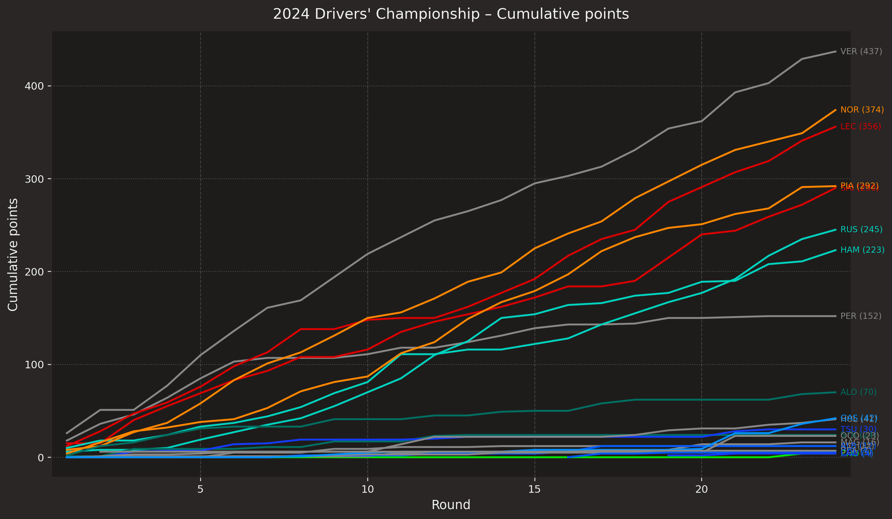
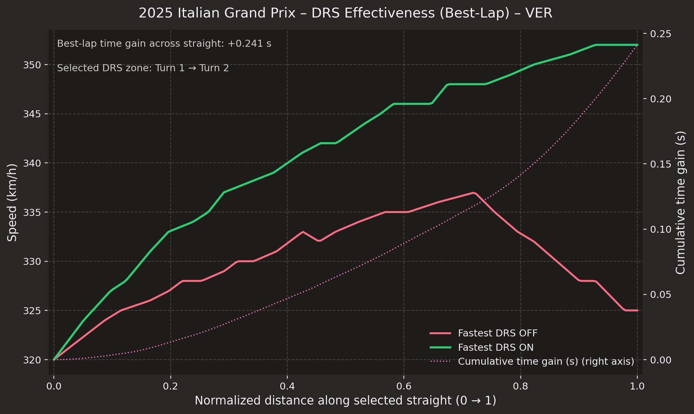

# Gallery

This page lists pre-rendered visuals. Each tile is backed by a reproducible script
and a YAML sidecar under `docs/assets/gallery/`.

<!-- AUTO-GALLERY:BEGIN -->

- :material-chart-bar: **2024 Drivers' Championship – Cumulative points**
  ---
  [{ loading=lazy }](assets/gallery/2024_drivers_championship_points.png){ .glightbox }
  _Total points by race (lines per driver)_

  `Source:` [tools/plots/driver_championship.py](https://github.com/ksherr0/fastf1_portfolio/blob/chore/update-documentation/tools/plots/driver_championship.py)  
  `Params:` `year=2024, include_sprints=True, color_variant=secondary, min_total_points=0.0, dpi=220`

- :material-chart-bar: **2025 Italian Grand Prix – DRS effect on main straight (VER)**
  ---
  [{ loading=lazy }](assets/gallery/italian_grand_prix_2025_drs_effect_VER.png){ .glightbox }
  _Median speed traces along main straight (DRS ON/OFF)_

  `Source:` [tools/plots/drs_effectiveness.py](https://github.com/ksherr0/fastf1_portfolio/blob/chore/update-documentation/tools/plots/drs_effectiveness.py)  
  `Params:` `year=2025, gp=Italian Grand Prix, session=R, driver=VER, n_points=200, accel_threshold_kmh_s=-8.0, sustain_sec=0.3`

- :material-chart-bar: **2025 Italian Grand Prix – Tyre Strategy**
  ---
  [{ loading=lazy }](assets/gallery/italian_grand_prix_2025_tyre_strategy.png){ .glightbox }
  _Stints and compounds by driver_

  `Source:` [tools/plots/tyre_strategy.py](https://github.com/ksherr0/fastf1_portfolio/blob/chore/update-documentation/tools/plots/tyre_strategy.py)  
  `Params:` `driver_order=results, bar_height=0.6, bar_gap=0.35, annotate_compound=True, dpi=220`

<!-- AUTO-GALLERY:END -->