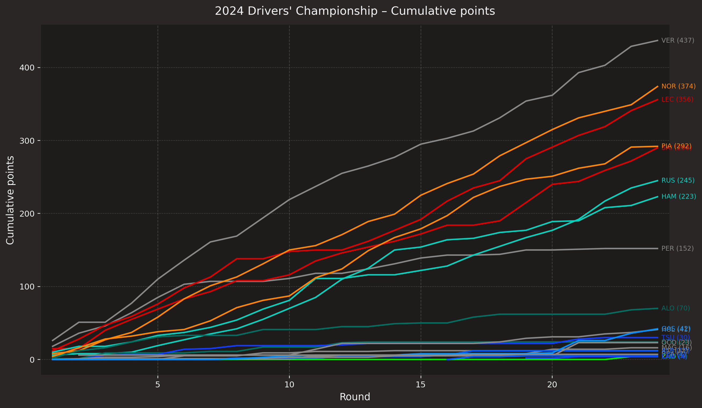
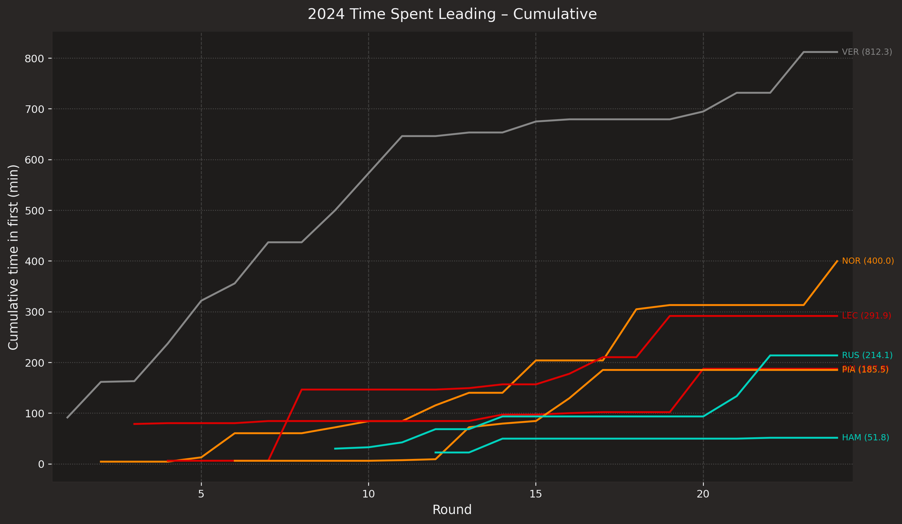
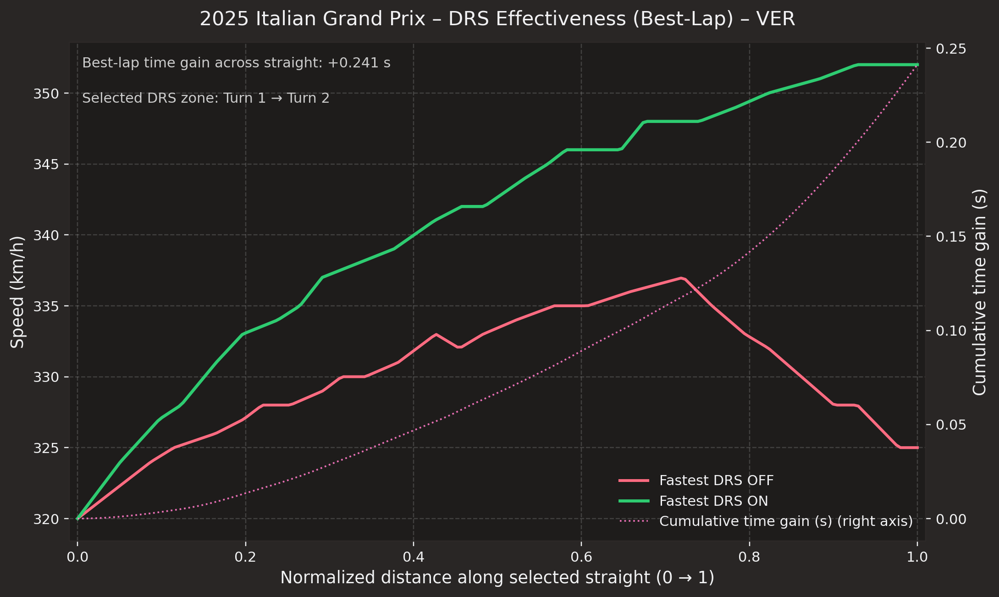
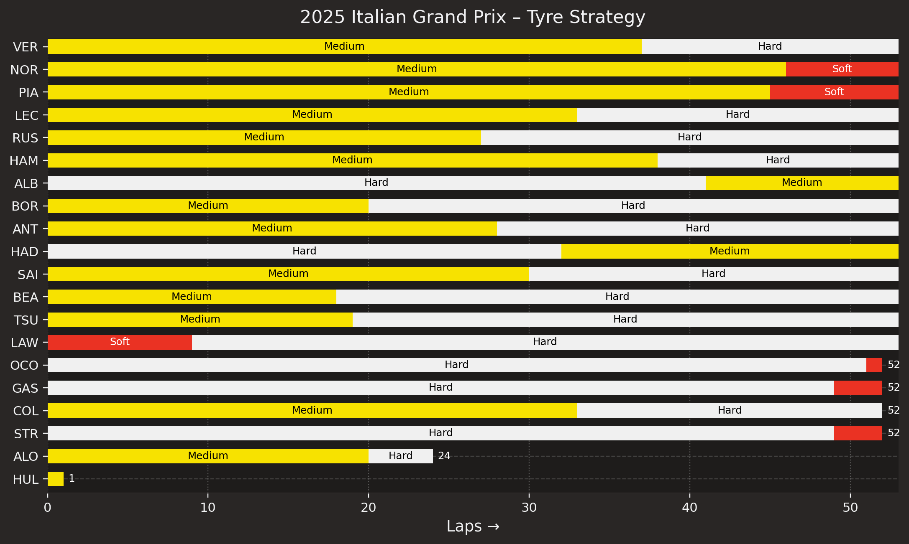

# Charts

**A visual index of the work**

These charts are the project's finished outputs: each one turns FastF1 session data into a focused comparison, pattern, or story. Open a visual to inspect it, then follow its source and parameters back to the analysis that produced it.

## Start with a visual

Use the gallery as a quick scan of the project's range, from season-long championship views to race-day telemetry and tyre strategy. Each tile is backed by a reproducible script and a YAML sidecar under `docs/assets/gallery/`.

<!-- AUTO-GALLERY:BEGIN -->

- :material-chart-bar: **2024 Drivers' Championship – Cumulative points**
  ---
  [{ loading=lazy }](../assets/gallery/2024-driver-championship-points.png){ .glightbox }
  _Total points by race (lines per driver)_

  `Source:` [tools/plots/driver_championship.py](https://github.com/kody-sherritze/fastf1_analytics/blob/main/tools/plots/driver_championship.py)  
  `Params:` `year=2024, include_sprints=True, color_variant=primary, min_total_points=1.0, dpi=220`

- :material-chart-bar: **2024 Time Spent Leading – Cumulative**
  ---
  [{ loading=lazy }](../assets/gallery/2024-driver-time-in-first.png){ .glightbox }
  _Cumulative minutes led by race (lines per driver)_

  `Source:` [tools/plots/time_in_first.py](https://github.com/kody-sherritze/fastf1_analytics/blob/main/tools/plots/time_in_first.py)  
  `Params:` `year=2024, color_variant=primary, min_total_time=30.0, dpi=220`

- :material-chart-bar: **2025 Italian Grand Prix – DRS effect on main straight (VER)**
  ---
  [{ loading=lazy }](../assets/gallery/2025-italian-gp-drs-effect-VER.png){ .glightbox }
  _Median speed traces along main straight (DRS ON/OFF)_

  `Source:` [tools/plots/drs_effectiveness.py](https://github.com/kody-sherritze/fastf1_analytics/blob/main/tools/plots/drs_effectiveness.py)  
  `Params:` `year=2025, event=Italian Grand Prix, session=R, driver=VER, n_points=200, accel_threshold_kmh_s=-8.0, sustain_sec=0.3`

- :material-chart-bar: **2025 Italian Grand Prix – Tyre lap times (clean race laps)**
  ---
  [{ loading=lazy }](../assets/gallery/2025-italian-gp-tyre-performance.png){ .glightbox }
  _Bars = median across drivers; dots = each driver (team-colored), annotated by driver code_

  `Source:` [tools/plots/tyre_performance.py](https://github.com/kody-sherritze/fastf1_analytics/blob/main/tools/plots/tyre_performance.py)  
  `Params:` `year=2025, event=Italian Grand Prix, min_laps_per_compound=1, aggregate=median, include_inter_wet=False, dpi=220`

- :material-chart-bar: **2025 Italian Grand Prix – Tyre Strategy**
  ---
  [{ loading=lazy }](../assets/gallery/2025-italian-gp-tyre-strategy.png){ .glightbox }
  _Stints and compounds by driver_

  `Source:` [tools/plots/tyre_strategy.py](https://github.com/kody-sherritze/fastf1_analytics/blob/main/tools/plots/tyre_strategy.py)  
  `Params:` `driver_order=results, bar_height=0.6, bar_gap=0.35, annotate_compound=True, dpi=220`

<!-- AUTO-GALLERY:END -->

## Go deeper

Pair a chart with its [case study](../case-studies/index.md) to read the analytical narrative, or visit [Creating New Visuals](../creating-new-visuals/index.md) to follow the path from session data to published image.
