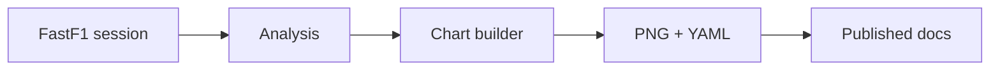

# FastF1 Analytics

## From race data to readable stories

FastF1 Analytics turns FastF1 session data into focused visual analyses: strategy timelines, tyre comparisons, telemetry studies, and season-long performance views.

{ loading=lazy }

_A tyre-strategy timeline from the 2025 Italian Grand Prix, generated from FastF1 race data._

## Explore the project

- :material-chart-bar: **Finished visuals**

	Browse the [Gallery](gallery/index.md) for a visual index of the latest rendered charts, source scripts, and production parameters.

- :material-file-document-edit: **Analytical insights**

	Read the [Case Studies](case-studies/index.md) for the questions, methods, and findings behind selected visuals.

- :material-source-branch: **Project architecture**

	Follow [Creating New Visuals](creating-new-visuals/index.md) through session loading, analysis, chart construction, publishing, and quality checks.

- :material-api: **Reusable Python code**

	Start at the [API Overview](api/index.md) to find the session loader, plotting helpers, chart builders, and generated package reference.

## Project Pipeline

The project keeps data access, analysis, rendering, and publishing distinct. Plot scripts load a FastF1 session, call reusable chart code, and write a PNG plus YAML sidecar. The documentation generators use those sidecars to build the gallery and case-study pages.

## Run it locally

The repository README contains the installation and command-line quickstart for generating visuals locally. This site focuses on the outputs, the architecture behind them, and the code that makes them reproducible.